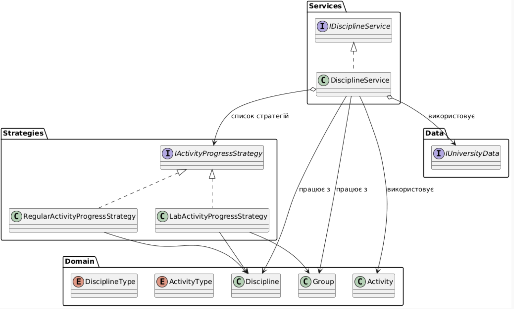
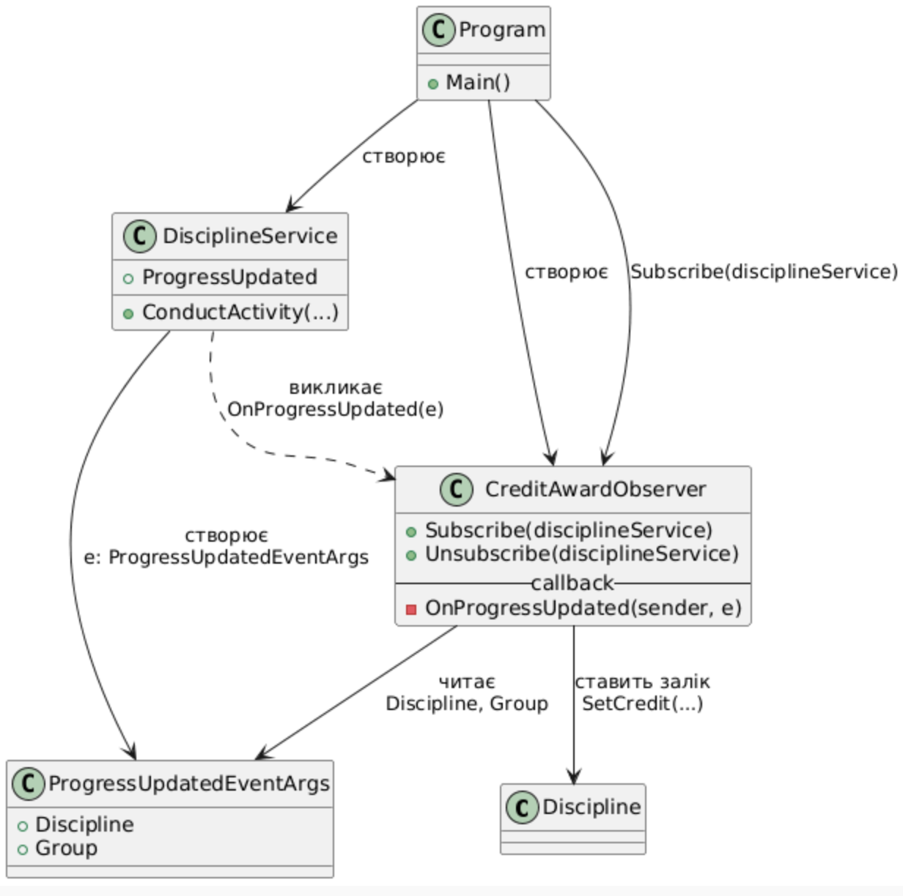

# 🎓 University Management System

Система для керування навчальним процесом, яка дозволяє автоматизувати роботу з групами та дисциплінами.

## 🚀 Основний функціонал

### 👥 Керування групами
* **Формування груп**: Реєстрація студентів та закріплення їх за академічними групами.
* **Поділ на підгрупи**: Автоматичне розділення великих груп на підгрупи для практичних занять.
* **Валідація кількості**: Система контролює, щоб у групі було не менше 10 осіб для виконання поділу.

### 📚 Навчальний процес
* **Планування дисциплін**: Налаштування годин для лекцій, лабораторних та модульних робіт.
* **Розподіл викладачів**: Можливість закріпити окремих викладачів за різними типами занять.
* **Контроль прогресу**: Відстеження проведених годин та автоматичне обмеження "перебору" понад план.

### ✅ Автоматизація заліків
* **Smart Credit**: Система автоматично виставляє залік, якщо студент відвідав усі заплановані години з основних типів занять.
* **Перевірка умов**: Автоматичний контроль готовності до заліку.

## 🏗 Архітектура системи

### 1. Ядро системи (Domain Entities)

### 2. Бізнес-логіка та дані (Services/Data)

### 3. Патерн Strategy (обробка прогресу активностей)
У проєкті використано шаблон **Strategy** для гнучкого оновлення прогресу різних типів активностей дисципліни.

* Інтерфейс **`IActivityProgressStrategy`** визначає спільний контракт:
  * `CanHandle(ActivityType)` — чи підтримує стратегія цей тип активності.
  * `AddHours(...)` — як додавати години до прогресу.
  * `IsFullyCompleted(...)` — як перевірити, що активність повністю виконана.
* Клас **`LabActivityProgressStrategy`** реалізує логіку для лабораторних робіт, враховуючи підгрупи (`SubGroupCompletedHours`).
* Клас **`RegularActivityProgressStrategy`** реалізує логіку для звичайних активностей (лекції, МКР, екзамен тощо), використовуючи загальний словник `CompletedHours`.
* Клас **`DisciplineService`** містить список стратегій і при проведенні активності (`ConductActivity`) обирає потрібну реалізацію через `GetProgressStrategy`, не знаючи деталей реалізації.

UML-діаграма реалізації патерна Strategy:

### 4. Патерн Observer (автоматичний залік)
Шаблон **Observer** використано для автоматичного виставлення заліку, коли всі необхідні активності по дисципліні завершені.

* Клас **`DisciplineService`** виступає як **генератор подій** і піднімає подію `ProgressUpdated` після кожного оновлення прогресу (`ConductActivity`).
* Клас **`ProgressUpdatedEventArgs`** містить інформацію про зміну: посилання на `Discipline`, `Group`, тип активності та кількість доданих годин.
* Клас **`CreditAwardObserver`** є **спостерігачем**, який підписується на подію `ProgressUpdated` через метод `Subscribe`.
  * В обробнику `OnProgressUpdated` він перевіряє:
	* чи для дисципліни запланована активність `Credit`;
	* чи ще не виставлено залік (`IsCreditAwarded == false`);
	* чи всі інші види активностей повністю завершені (через публічний метод `DisciplineService.IsActivityFullyCompleted`).
  * Якщо всі умови виконані — викликає `discipline.SetCredit(creditHours)` і таким чином **автоматично** виставляє залік.
* У **`Program`** створюється екземпляр `DisciplineService` та `CreditAwardObserver`, після чого observer підписується на подію сервісу.

UML-діаграма реалізації патерна Observer:

