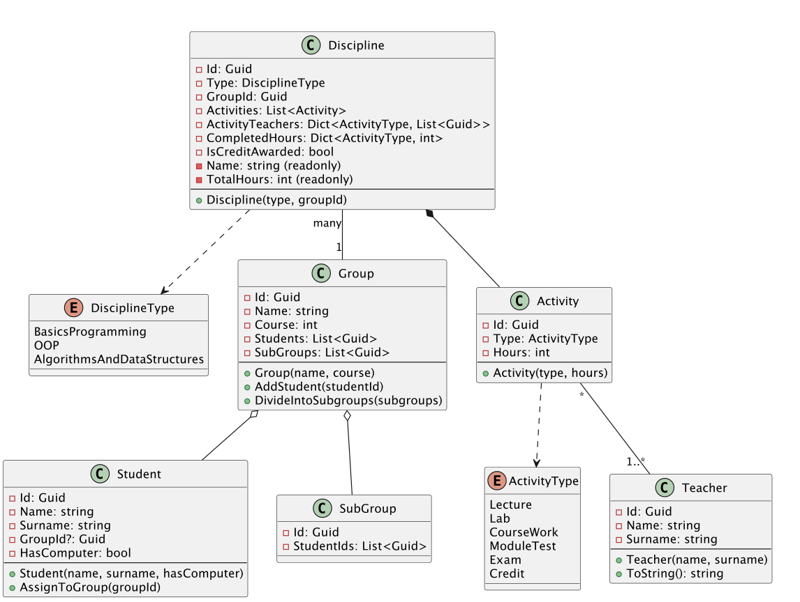
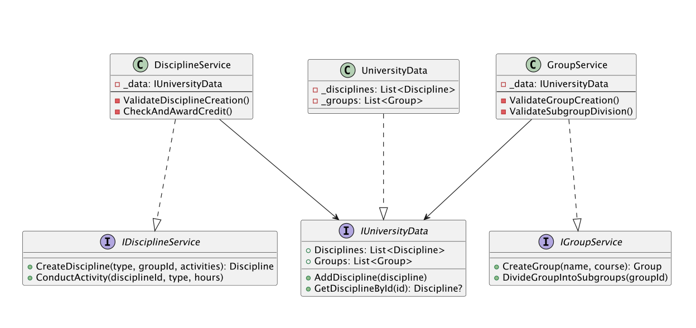

# 🎓 University Management System

Система для керування навчальним процесом, яка дозволяє автоматизувати роботу з групами та дисциплінами.

## 🚀 Основний функціонал

### 👥 Керування групами
* **Формування груп**: Реєстрація студентів та закріплення їх за академічними групами.
* **Поділ на підгрупи**: Автоматичне розділення великих груп на підгрупи для практичних занять.
* **Валідація кількості**: Система контролює, щоб у групі було не менше 10 осіб для виконання поділу.

### 📚 Навчальний процес
* **Планування дисциплін**: Налаштування годин для лекцій, лабораторних та модульних робіт.
* **Розподіл викладачів**: Можливість закріпити окремих викладачів за різними типами занять.
* **Контроль прогресу**: Відстеження проведених годин та автоматичне обмеження "перебору" понад план.

### ✅ Автоматизація заліків
* **Smart Credit**: Система автоматично виставляє залік, якщо студент відвідав усі заплановані години з основних типів занять.
* **Перевірка умов**: Автоматичний контроль готовності до заліку.

## 🏗 Архітектура системи

### 1. Ядро системи (Domain Entities)

### 2. Бізнес-логіка та дані (Services/Data)

